# GitHubの使い方

## 機能追加の流れ
### 1. issueを作成
わかりやすいように書きましょう。特にルールはないです。
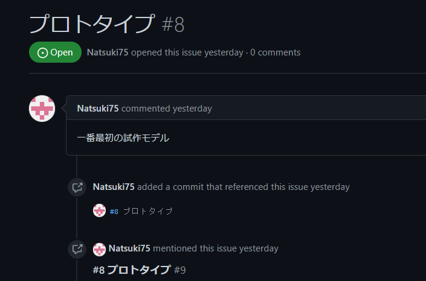

### 2. ブランチの作成
ブランチを作成する前に以下のコマンドを打っておきましょう。mainブランチに最新の状態を反映させることができます。
```sh
git switch main
git pull
```


ブランチ名のルール ： issueを作成すると #8 のように issueそれぞれに番号が与えられます。
`8-(作成する機能名など)` というように名前を付けてください。
ブランチを作成するコマンドは以下の通りです。
```sh
git switch -c ブランチ名
```

<!-- VScodeを用いた方法 折り畳み表示 -->
<details>
<summary>VScodeを用いた方法</summary>
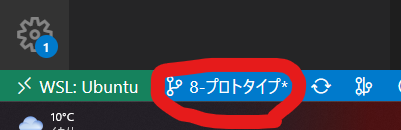
<div>
VScodeの左下にあるブランチのアイコンをクリックすると、ブランチの選択画面が出てきます。
</div>
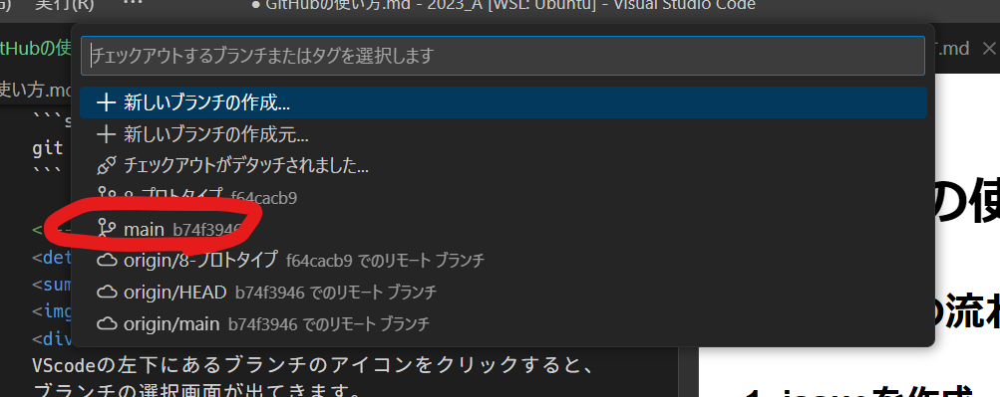
<div>
まずはmainブランチに切り替えます。
</div>
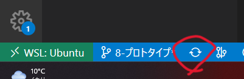
<div>
mainブランチに最新の状態を反映させます。
</div>
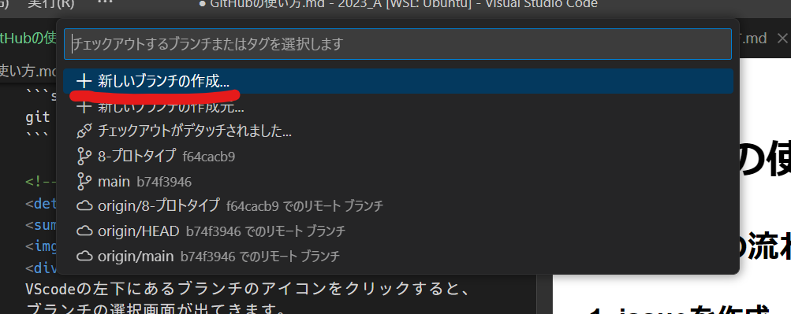
<div>
ブランチを作成します。
</div>
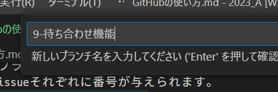
<div>
ブランチの名前は `(issue番号)-(作成する機能名など)` というように名前を付けてください。
</div>
</details>

### 3. コミットまでの流れ
作業が完了したら、まずは作業したファイルをaddします。
```sh
git add (ファイル名)
```
すべてのファイルをaddする場合は以下のコマンドを打ちましょう。
```sh
git add .
```

次にcommitします。
```sh
git commit -m "#8 (作成した機能の概要など)"
```
コミットメッセージにもissue番号を先頭につけてください。

最後にpushします。
```sh
git push origin ブランチ名
```

<!-- VScodeを用いた方法 折り畳み表示 -->
<details>
<summary>VScodeを用いた方法</summary>
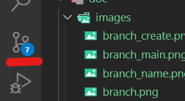
<div>
作業が完了したら、VScodeの左側にある Git のアイコンをクリックします。
</div>
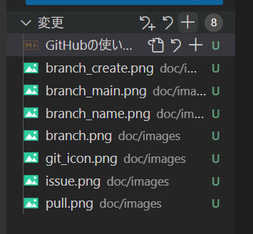
<div>
作業したファイルを「＋」 ボタンを押すことによってaddします。
</div>

<div>
ステージされていることを確認し、コミットメッセージを記入したら、青色のコミットボタンを押します。
</div>
</details>

作業したブランチにpushしたら、GitHubのページに移動します。

### 4. Pull Requestの作成
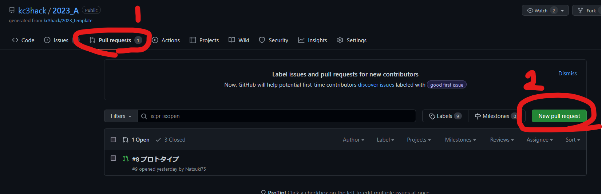
GitHubのページに移動したら、上の方にある `Pull requests` をクリック、`Compare & pull request` をクリックします。

<!-- Compare & pull request がない場合  -->
<details>
<summary>Compare & pull request がない場合</summary>
<div>
ない場合は`New pull request` をクリックします。
</div>
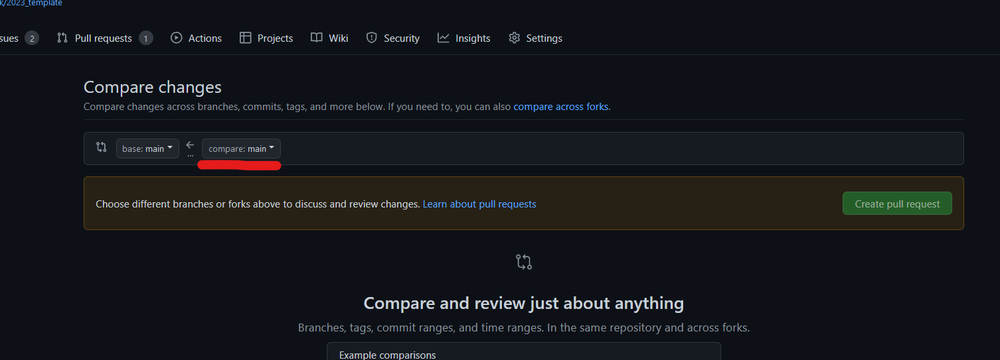
<div>
`compare: main` をクリックし、作成したブランチを選択し、`Create pull request` をクリックするとプルリクエストが作成されます。
</div>
</details>

プルリクエストのメッセージを書いて、プルリクエストを作成します。


### 5. レビュー
プルリクエストが作成されたら、レビューをしてもらいます。

レビューをする人は、プルリクエストが作成されたブランチに移動し。新しく追加された機能に問題がないか確認します。
```sh
git pull  # 最新の情報に更新するために必要
git switch ブランチ名
```

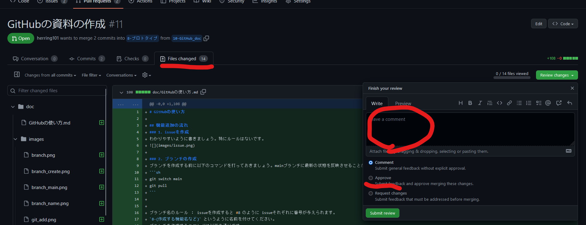
File changed をクリックすると、プルリクエストで追加・変更されたファイルが表示されます。
問題がなければReview changesをクリックし、コメントを入力し、Approveをクリック、`Submit review` をクリックしレビューを完了させましょう。


Approveされたら、プルリクエストをマージします。
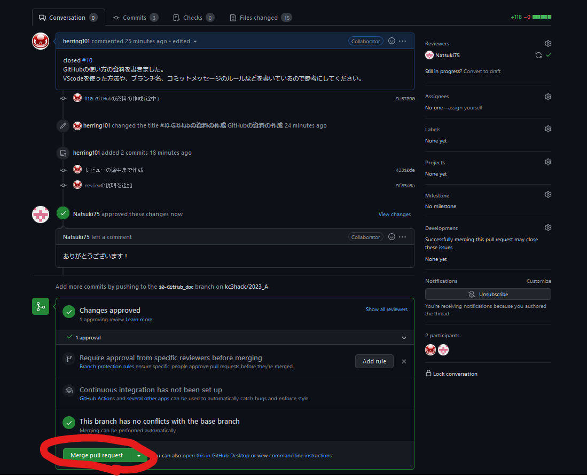

お疲れ様でした！