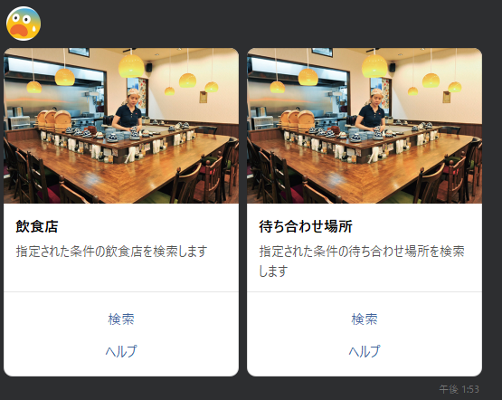

# Chatcatの仕様
## 概要
Chatcatは、おすすめの飲食店、アパレル店、待ち合わせ場所などを提案してくれるLINEBotです。
LINEの友達登録をすることで、すぐに利用することができます。

## 機能の作成方法
### 概要
```py
# 例
def recommend_restaurant():
    # 保存している変数を取り出す
    try:
        変数1,変数2,変数3, = chatcat.data["restaurant_data"]
    except:
        変数1,変数2,変数3 = 1,2,3

    # カルーセルのボタンが押されるとPostbackが送られてくる
    if event.type == "postback":
        # Postbackのdataには、カルーセルのボタンのactionのdataが入っている
        # 詳しくは次の章の「カルーセルの作成方法」を参照
        if event.postback.data == "何かしらの値":
            # 何かしらの処理
            pass
        elif event.postback.data == "何かしらの値":
            # 何かしらの処理
            pass

    # カルーセルのボタンが押されない場合は、メッセージが送られてくる
    if event.type == "message":
        # メッセージのテキストを取得
        text = event.message.text
        if text == "何かしらの値":
            # 何かしらの処理
            pass
        elif text == "何かしらの値":
            # 何かしらの処理
            pass

    # もし、処理を終了する場合は、modeを"normal"に変更する
    chatcat.mode = "normal"

    # 最後に変数を保存する
    chatcat.data["restaurant_data"] = 変数1,変数2,変数3
```

### カルーセルの作成方法
```py
# 例 ボット起動時に表示されるカルーセル
columns_list = []
columns_list.append(
    CarouselColumn(
        thumbnail_image_url="https://cdn.projectdesign.jp/uploads/201601/images/gazou/24_1.jpg",
        title="飲食店",
        text="指定された条件の飲食店を検索します",
        actions=[
            PostbackAction(label="検索", data="restaurant"),
            PostbackAction(label="ヘルプ", data="help")
        ]
    )
)
columns_list.append(
    CarouselColumn(
        thumbnail_image_url="https://cdn.projectdesign.jp/uploads/201601/images/gazou/24_1.jpg",
        title="待ち合わせ場所",
        text="指定された条件の待ち合わせ場所を検索します",
        actions=[
            PostbackAction(label="検索", data="apparel"),
            PostbackAction(label="ヘルプ", data="help")
        ]
    )
)

# カルーセルを送信するメソッドは、add_carousel()です
chatcat.add_carousel("スタートメッセージ",columns_list)
```
こんな感じになります。
